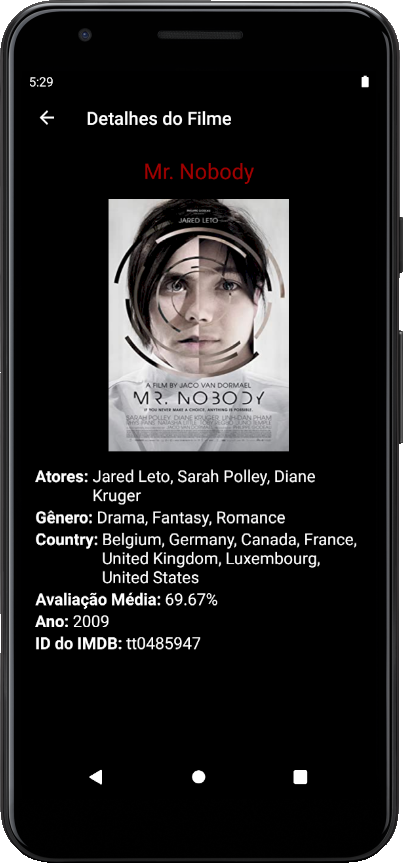

# Movie List - React Native App

  

  

  

Premissas
-------------
1. Usar Redux para controle de possíveis estados globais
2. Estruturar o app para que fique escalável
3. Desenvolver primeiro as funcionalidades exigidas 
4. Utilizar componentes prontos para simplificar o design
5. Usar Typescript
6. Usar Testes unitários (Jest);

Decisões
-------------

### Estrutura do App
Foi criada a pasta src para organizar o projeto e simplificar possíveis evoluções, dentro dela há as seguintes subpastas:
  - assets: será armazenada todas as imagens usadas;
  - components: quaisquer components que venham a ser criados e que podem ser utilizados em diferentes telas;
  - constants: 
      - arquivos apis => contém o nome de todas as rotas que o app poderá utilizar
      - colors => definido de cores que o aplicativo vai usar, para evitar diferentes cores na mesma aplicação
      - config => quaisquer constantes de configuração, como uma apiKey.
  - redux: contém todos os reducers e store
  - screens: pasta com todas as telas do app

O projeto foi inicializado a partir do template react-native-template-typescript

### Redux
A única informação importante de se compartilhar por todos os componentes/telas do app é o filme clicado, portanto essa informação foi salva no Redux.

Como usar o projeto
-------------
Baixe a apk: https://drive.google.com/file/d/1ogrqNc9szmlBbTmCJu2VpIEh-4aWQccw/view?usp=sharing

Se preferir rodar na sua própria máquina:
Siga as instruções de configuração do ambiente de acordo com a documentação oficial do React Native - https://reactnative.dev/docs/environment-setup

Na raíz do projeto rode: 
  1. npm install
  2. npx react-native start

### Ambiente Linux ou Windows
  1. npx react-native run-android

### Ambiente Mac OS
  1. cd ios
  2. pod install
  3. cd ..
  4. npx react-native run-android
  
TODO: Testes Unitários (Jest)
-------------
